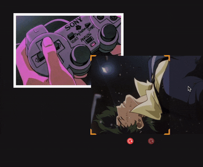

# Photos Wall (Nostalgi) 🖼️

Interactive photo collage application where you can create beautiful photo walls! Upload your photos, arrange
them however you like, and customize everything to your heart's content.

👀 Check out the app here:
https://leodiana.github.io/photos-wall/



## ✨ Main Features

- **Photo Upload & Management** - Upload multiple photos and organize them on your wall
- **Drag & Drop** - Simply drag photos from the side panel onto your wall and position them anywhere you want
- **Image Editing** - Rotate, resize, and adjust your photos with intuitive controls
- **Customizable Frames** - Add borders or frames to make your photos stand out
- **Stickers** - Add fun stickers to decorate your photo wall
- **Background Options** - Choose from various background colors and images
- **Zoom Controls** - Zoom in and out to see the big picture or focus on details
- **Viewing Mode** - Toggle between edit mode and viewing mode for a clean, distraction-free experience

## 📝 Note About Firebase

For the deployed version, Firebase has been removed and replaced with local storage (sessionStorage). This means:

- All your photos and settings are stored locally in your browser
- When you reload the page, your work will be cleared (this is by design for privacy)

This makes the app super lightweight and perfect for quick photo wall creation without any setup or authentication
needed.

## 🛠️ Tech Stack

- **Vite, React, TypeScript, Styled Components, Tailwind, Zustand**

---

Enjoy creating your photo walls! 🎨

## 🚀 Getting Started

### Prerequisites

- Node.js (v18 or higher recommended)
- npm or yarn

### Installation

1. Clone the repository:

```bash
git clone <your-repo-url>
cd photos-wall
```

2. Install dependencies:

```bash
npm install
# or
yarn install
```

3. Start the development server:

```bash
npm run dev
# or
yarn dev
```

4. Open your browser and navigate to the URL shown in the terminal (usually `http://localhost:5173`)

